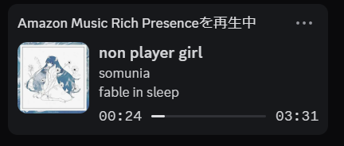
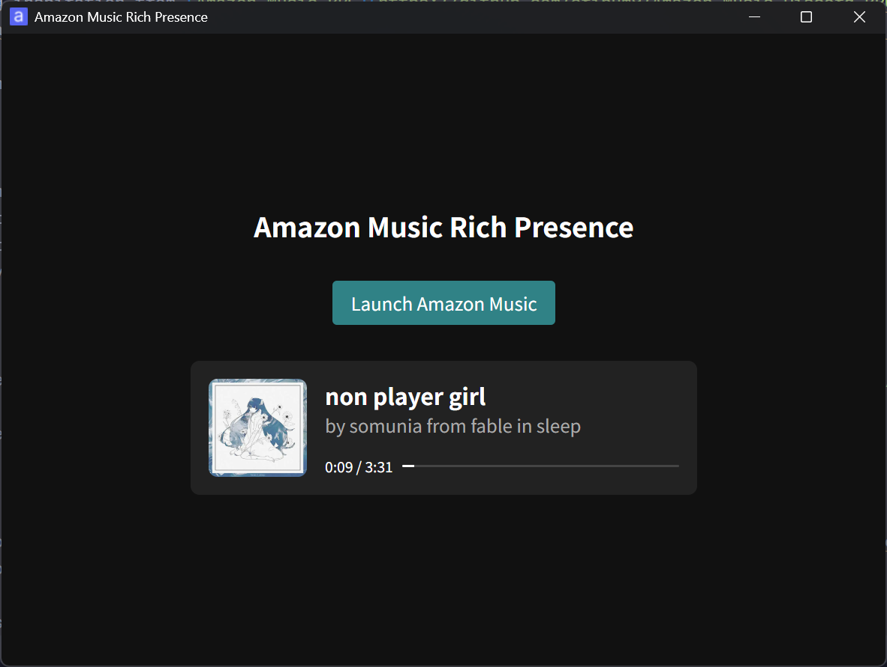

# Amazon Music Rich Presence

  

> [!IMPORTANT]
> This is an unofficial community project completely unrelated to Amazon or Discord.

This is a small tool that displays information about the track currently playing in Amazon Music as Discord Rich Presence.

I wrote it from scratch, taking inspiration from [Amazon Music RPC](https://github.com/eripum9/Amazon-Music-Discord-RPC) and borrowing some ideas from its implementation. This project takes a more minimal approach and targets the non-Microsoft Store version of Amazon Music.

If you need support for more environments or a broader feature set, use Amazon Music RPC instead.

## Features

- Displays the current track information and playback position from Amazon Music as Discord Rich Presence
- Supports the non-Microsoft Store version of the Amazon Music desktop client
- Simple UI with a minimal feature set
- Supports minimizing to the system tray

Discord Rich Presence:

App window:

## Usage

1. Download the latest installer from [Releases](https://github.com/Robot-Inventor/amazon-music-rich-presence/releases/latest)
2. Run the installer
3. Launch Amazon Music Rich Presence, then click [Launch Amazon Music] to start Amazon Music

## Limitations

- Only supports the non-Microsoft Store version of the Amazon Music desktop client downloaded from Amazon's official website
- Expected to work in all regions, but only tested with the Japanese Amazon Music service and desktop client
- Windows only at this time
- Requires launching Amazon Music from Amazon Music Rich Presence to display track information in Rich Presence
